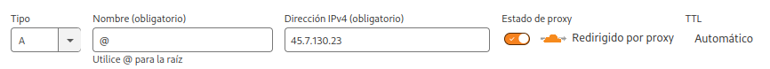
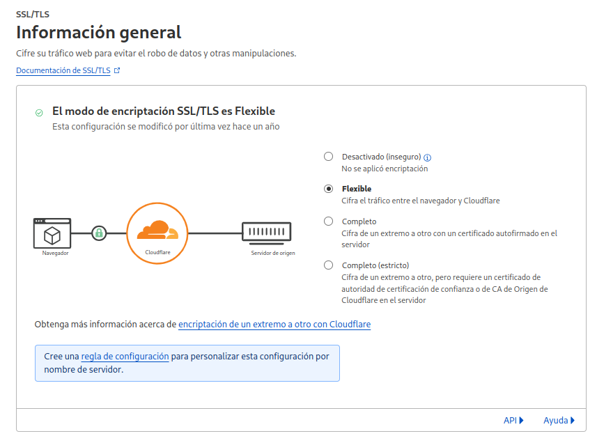

+++
title = "Despliegue básico de Django con Docker, Traefik y CloudFlare"
date = "2023-12-08T11:19:13-03:00"
#dateFormat = "2006-01-02" # This value can be configured for per-post date formatting
author = "Alitux"
authorTwitter = "alituxtdf" #do not include @
cover = ""
tags = ["django", "python", "sysadmin", "docker", "odoo", "devops"]
keywords = ["", ""]
description = "Aprende a desplegar una aplicación Django de forma segura y escalable usando Docker para contenerización, Traefik como reverse proxy con certificados SSL automáticos, y Cloudflare para protección DDoS, caché y gestión de DNS. Este tutorial cubre la configuración paso a paso, incluyendo la integración con HTTPS, optimización de tráfico y solución de problemas comunes. Ideal para entornos de producción con alta disponibilidad."
showFullContent = false
readingTime = true
hideComments = false
+++

En el momento del despliegue de aplicaciones Django se pueden optar por diversas opciones desde la clásica con una VPS, pasando por Heroku, AWS o bien Docker.

En esta entrada voy a explicar cual es el método que aplico yo para desplegar una aplicación Django utilizando mi combinación ganadora en una VPS:

- Docker
- Traefik
- CloudFlare

Es un tutorial que se puede tornar confuso y complejo si no tenés mucha experiencia con el manejo de Docker. Tambien implica tener funcionando correctamente Traefik. En [este enlace](https://gitlab.com/alitux/portainer-templates/-/blob/master/stacks/traefik/docker-compose.yml) les dejo la configuración que uso yo. Sugiero que lo lean y en todo caso vean como lo adaptan a sus implementaciones.

## La Previa

Lo primero que debemos definir es que comprende nuestra aplicación Django:

- Base de datos
- Manejo de estáticos
- Etc.

Para este caso vamos a suponer que la aplicación tiene los estáticos comunes y corrientes, y que a su vez usa una base de datos PostgreSQL.

Tendremos una estructura básica de proyecto Django del tipo:

```
/unaapp
/miproyecto
manage.py
requirements.txt
```
## Metiendo las manos en el barro

Supongo que ya estás con tu ambiente activado y en la carpeta raíz del proyecto, si no es así, activalo ahora mismo porque vamos a instalar gunicorn, django-environ y whitenoise:
```bash	
pip install gunicorn django-environ whitenoise
```

Freezamos las dependencias:

```bash	
pip freeze > requirements.txt
```
### Dockerfile

Vamos a definir el Dockerfile que generará la imagen de nuestro proyecto, para ellos creamos un archivo Dockerfile con el siguiente contenido:

```dockerfile
FROM python:3.11.0-alpine3.17
ENV PYTHONUNBUFFERED=1
RUN apk update \
    && apk add --no-cache gcc musl-dev python3-dev libffi-dev \
    && pip install --upgrade pip
 
COPY ./requirements.txt ./
 
RUN  pip install -r requirements.txt
ADD . ./app
WORKDIR /app
# RUN python manage.py migrate
# RUN python manage.py collectstatic --noinput
CMD ["gunicorn", "--bind", ":8000", "--workers", "2", "miproyecto.wsgi:application"]
EXPOSE 8000
```
**Observen la anteúltima línea en la que damos entrada a gunicorn: el «miproyecto» es el nombre de nuestro proyecto. Seguramente el nombre de tu proyecto no es «miproyecto», cambialo por el tuyo. La cantidad de workers es igual a la cantidad de núcleos del procesador (No es regla general, hay que tener criterio y de última hacer pruebas de carga, pero para empezar está bien) 😛**

### docker-compose.yml (Solo por puertos, sin traefik)

Para empezar a laburar vamos a hacer una prueba sin Traefik, solo con puertos para comprobar que todo esté funcionando bien.

El modelo que sugiero es el siguiente:

```docker-compose

# networks:
  # traefik:
    # external: true
 
services:
  db:
    image: postgres:15.2-alpine
    environment:
      POSTGRES_USER: ${USER_DB}
      POSTGRES_PASSWORD: ${PASSWORD_DB}
      POSTGRES_DB: ${NAME_DB}
    volumes:
      - postgresql:/var/lib/postgresql/data
    networks:
      - default
  app:
    build:
      context: .
      dockerfile: Dockerfile
    image: valorarte
    ports:
      - "8000:8000"
    networks:
      - default
    depends_on:
      - db
    restart: always
      # - traefik
    # labels:
      # - traefik.enable=true
      # - traefik.docker.network=traefik
      # - traefik.http.routers.${TRAEFIK_NAME}.rule=Host(`${DOMAIN}`)||Host(`www.${DOMAIN}`)
      # - traefik.http.routers.${TRAEFIK_NAME}.entrypoints=http
      # - traefik.http.services.${TRAEFIK_NAME}-svc.loadbalancer.server.port=8000
volumes:
  postgresql:
  ```

Como verán en ese archivo tenemos variables de entorno para el servicio **db** y las labels de traefik(Las que están comentadas porque estamos en local), las cuales definiremos junto a otras que usaremos después en un archivo .env

```env
SECRET_KEY=fa3u)zsxpl-xj5kswm48dd&(#v!lv^h!pej9zr_41v!_w#%0+w
PRODUCTION=False
TRAEFIK_NAME=miproyecto
DOMAIN=proyecto.tudominio.com.ar
GENERAL_DOMAIN=tudominio.com.ar
NAME_DB=tudb
USER_DB=usuariodb
PASSWORD_DB=tupassword
```
Si, me imagino que están ansiosos por levantar todo el stack y probar que funciona, pero hay algunos detalles que resolver relacionado con esas variables de entorno. Por defecto, uno por lo general desarrolla usando sqlite, por lo que debemos vincular Django con PostgreSQL dentro de **settings.py**. Para ello agregaremos las siguientes líneas:

```python
import environ #Al principio del archivo
 
env = environ.Env()
env_file = os.path.join(BASE_DIR, '.env')
env.read_env(env_file)
 
if env('PRODUCTION') == "True": 
    PRODUCTION = True
else:
    PRODUCTION = False
 
SECRET_KEY = env('SECRET_KEY')
 
# SECRET_KEY = '$%g!fflv0ezz*#jr%ui+3edvxx6l$ugh!6*kq(@9gsqu!7wla('
 
DEBUG = True
 
if PRODUCTION is True:
    DEBUG = False
    DOMAIN = env('DOMAIN')
    GENERAL_DOMAIN = env('GENERAL_DOMAIN')
    NAME_DB = env('NAME_DB')
    USER_DB = env('USER_DB')
    PASSWORD_DB = env('PASSWORD_DB')
 
    ALLOWED_HOSTS = ["localhost", DOMAIN,
                     f"www.{DOMAIN}"]
    CSRF_COOKIE_DOMAIN = f".{GENERAL_DOMAIN}"
    CSRF_COOKIE_SECURE = True
    CSRF_TRUSTED_ORIGINS = [f"https://{DOMAIN}", 
                            f"https://www.{DOMAIN}",
                            f"http://{DOMAIN}", 
                            f"http://www.{DOMAIN}",
                            ]
    DATABASES = {
    'default': {
        'ENGINE': 'django.db.backends.postgresql',
        'NAME': NAME_DB,
        'USER': USER_DB,
        'PASSWORD': PASSWORD_DB,
        'HOST': 'db',
        'PORT': '5432',
    }
}
else:
    DEBUG = True
    ALLOWED_HOSTS = ["*"]
 
    DATABASES = {
    'default': {
        'ENGINE': 'django.db.backends.sqlite3',
        'NAME': os.path.join(BASE_DIR, 'db.sqlite3'),
    }
}
```

También debemos agregar whitenoise en los middleware:

```python 
MIDDLEWARE = [
    'django.middleware.security.SecurityMiddleware',
    'whitenoise.middleware.WhiteNoiseMiddleware',
    'django.contrib.sessions.middleware.SessionMiddleware',
    'django.middleware.common.CommonMiddleware',
    'django.middleware.csrf.CsrfViewMiddleware',
    'django.contrib.auth.middleware.AuthenticationMiddleware',
    'django.contrib.messages.middleware.MessageMiddleware',
    'django.middleware.clickjacking.XFrameOptionsMiddleware',
]
```

Y comprobar las rutas de los estáticos:

```python
STATIC_ROOT = os.path.join(BASE_DIR, 'static')
```

Pufff, ahora si, ya tenemos listo nuestro **settings.py** para despliegue en local y producción vinculado a un dominio. Ahora si, si se animan pueden probar el glorioso: 
```bash
docker compose up -d --build
```

Si todo salió bien, cuando visten en su navegador **http://localhost:8000** deberían ver algo del proyecto. Digo «Algo» porque falta algunos pasitos importantes que algunos se habrán dado cuenta: Falta migrar la base de datos, colectar los estáticos y, en caso de que sea necesario, crear un superusuario.

```bash
docker compose exec app python manage.py makemigrations
docker compose exec app python manage.py migrate
docker compose exec app python manage.py collectstatic
docker compose exec app python manage.py createsuperuser
```
**¡FELICITACIONES! Tu proyecto está dockerizado ¡Nada mal!**

## ¡Nos vamos a Producción!

Ya probaste que anda todo bien, ya viste que tu aplicación anda precioso en el contenedor, pero nos falta algo importante: Llevarlo a nuestra VPS y apuntarlo al dominio de alguna forma.



Y la encriptación debe estar en **Flexible**



Ya tenemos el dominio apuntado, solo nos falta desplegar el proyecto en la VPS. 🙂

### Despliegue en VPS

Obviamente tenemos que entrar a la VPS de alguna forma y no es objeto del presente tutorial abordar ese tema, por lo que voy a suponer que ya estás en la VPS, que la misma tiene docker instalado y traefik corriendo de forma correcta.

Si tenés el proyecto en Git, lo tendrás que clonar en algún lugar. También supongo que configuraste bien tu repo y dentro del .gitignore filtraste toda la data sensible (Entre ellos el .env de desarrollo ;)) o particular de la ejecución. Si no es así, es un buen momento para que le pegues una segunda mirada a todo.

Dentro de la carpeta del proyecto crearemos un nuevo .env con el contenido similar al anterior:
```env
SECRET_KEY=qhkz_4!jjq&!*r-g2ijutl_4fj8x50ls=v0^6)ej18-e!zqdzq
PRODUCTION=True
TRAEFIK_NAME=miproyecto
DOMAIN=proyecto.tudominio.com.ar
GENERAL_DOMAIN=tudominio.com.ar
NAME_DB=tudb
USER_DB=usuariodb
PASSWORD_DB=tupassword
```
Allí verán que **PRODUCTION** pasó a True por lo que ahora si usará PostgreSQL, se vinculará al dominio y se definirán otros parámetros para que todo funcione pipí cucú.

En el compose **DESCOMENTAMOS** Todo lo que estaba comentado, por lo que el archivo quedará algo así: 

```docker-compose
networks:
  traefik:
    external: true
 
services:
  db:
    image: postgres:15.2-alpine
    environment:
      POSTGRES_USER: ${USER_DB}
      POSTGRES_PASSWORD: ${PASSWORD_DB}
      POSTGRES_DB: ${NAME_DB}
    volumes:
      - postgresql:/var/lib/postgresql/data
    networks:
      - default
  app:
    build:
      context: .
      dockerfile: Dockerfile
    image: lupin
    ports:
      - "8000:8000"
    networks:
      - default
      - traefik
    depends_on:
      - db
    restart: always
       
    labels:
      - traefik.enable=true
      - traefik.docker.network=traefik
      - traefik.http.routers.${TRAEFIK_NAME}.rule=Host(`${DOMAIN}`)||Host(`www.${DOMAIN}`)
      - traefik.http.routers.${TRAEFIK_NAME}.entrypoints=http
      - traefik.http.services.${TRAEFIK_NAME}-svc.loadbalancer.server.port=8000
volumes:
  postgresql:
  ```
Si todo está bien, entonces llegó el momento de…

```bash
docker compose up -d --build
```

Vayan al dominio y deberían ver algo relacionado con su Proyecto. 🙂 

Si es así **¡Felicitaciones!** Ahora pueden hacer las migraciones, colectar los estáticos, crear el superuser y disfrutar. 🙂