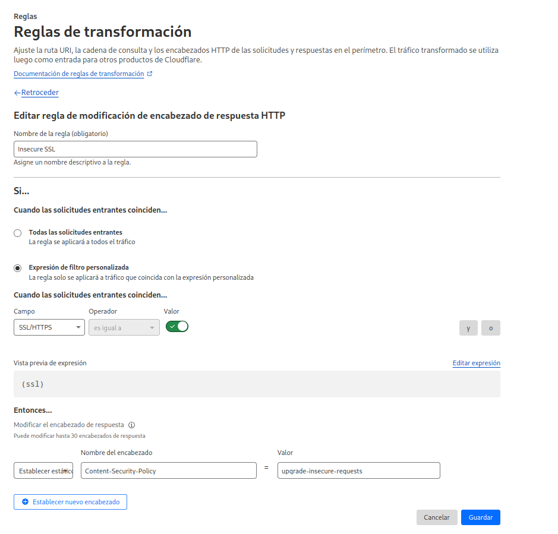

+++
title = "Odoo 16, Docker y Cloudflare: Editor web se queda colgado"
date = "2023-06-24T11:19:13-03:00"
#dateFormat = "2006-01-02" # This value can be configured for per-post date formatting
author = "Alitux"
authorTwitter = "alituxtdf" #do not include @
cover = ""
tags = ["odoo", "cloudflare"]
keywords = ["", ""]
description = "Al implementar Odoo 16 con Docker, Traefik y Cloudflare, el editor web puede quedarse cargando indefinidamente debido al SSL Flexible de Cloudflare. La solución es agregar una regla de transformación en Cloudflare modificando el encabezado de respuesta: establece el 'Content-Security-Policy' con el valor 'upgrade-insecure-requests'"
showFullContent = false
readingTime = true
hideComments = false
+++

Cuando intenté probar Odoo 16 en conjunto con Docker, Traefik y Cloudflare andaba todo excepto el editor web, que se quedaba «pensando y pensando». Como suponía la cosa venía por el lado del contenido inseguro y el SSL Flexible de Cloudflare, así que me puse manos a la obra y dentro de las reglas, cree una nueva regla de transformación para Modificar encabezado de Respuesta. La regla debería quedar así: 

Si, no les voy a dejar una captura de pantalla, acá va lo que tienen que poner en los campos:

**Nombre del encabezado:** Content-Security-Policy

**Valor:** upgrade-insecure-requests

Guardamos, vamos al Odoo, actualizamos y **¡Listo el pollo!**